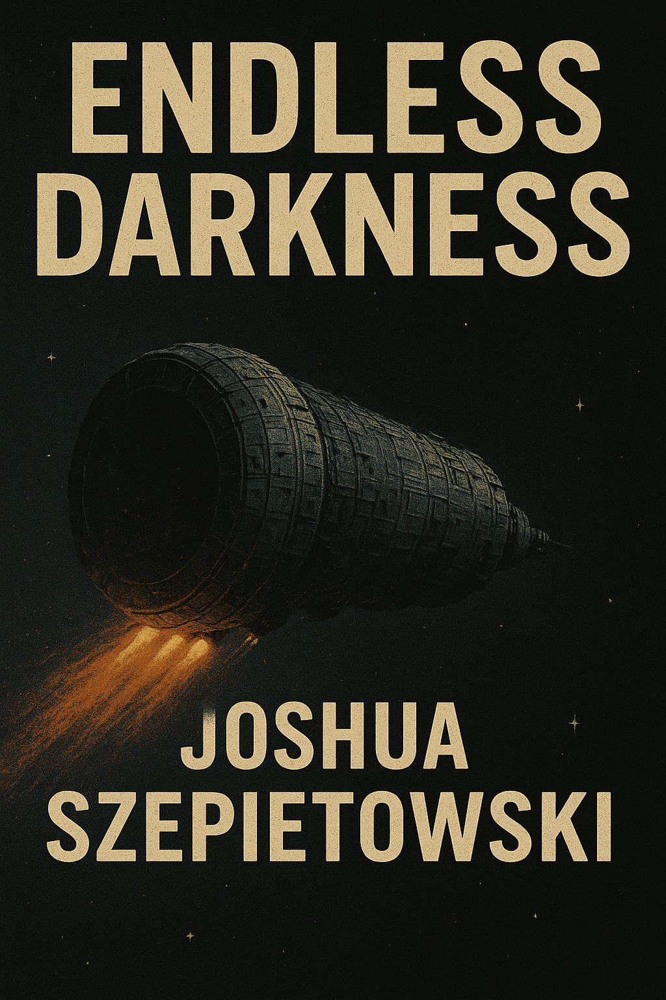

# Endless Darkness

Endless Darkness is a character-driven science fiction novel steeped in quiet, persistent terror. It is set aboard a massive generation ship carrying millions of people across interstellar space, where the threat that drove humanity from Earth never fully stops feeling like it is still on its way. The story follows Jonah Hale, a quiet and brilliant young man shaped by generational trauma, untreated mental illness in his family, and a lifetime spent hiding his own storms. It is a narrative about fear, love, faith, recovery, and the search for a place to rest when nothing in the external world can truly be called safe.

This repository contains the full structure of the novel, including chapters, worldbuilding documents, character profiles, thematic notes, outlines, and research materials. It is designed for clarity, iteration, and long-term development of a single, coherent atmosphere of dread.

## Core Premise

Roughly 22,000 years ago, humanity discovered a rogue ice giant on a collision course with Earth. With about 2,000 years to prepare, the world united to build thousands of enormous generation ships and, roughly 20,000 years ago, launched them toward distant stars. The journey itself is a 40,000-year mission, now halfway complete. Across the millennia since launch, communication with Earth and the other ships has long been lost. No one aboard Jonah’s ship knows whether anything human still waits behind them or ahead of them.

For Jonah, the ship is all he has ever known. Its metal corridors, artificial dawns, and watching systems are his entire sky. It is his world, his cage, and his inheritance.

Jonah’s life begins to shift when he falls in love with Sera Solano, a woman who sees him clearly and does not turn away from what she finds. As Jonah tries to hold his life together, the unresolved storms inside him begin to break open. The ship’s AI notices. Jonah’s family notices. Jonah himself cannot avoid the truth, or the terror of becoming the very things he fears.

Endless Darkness follows Jonah through formation, connection, unraveling, collapse, and restoration as he learns what it means to seek help, to accept love without trusting it blindly, and to build a home within himself when the larger world feels inescapably precarious.

## Repository Structure

* **chapters**
  Draft chapters of the novel.

* **docs/characters**
  Detailed character profiles for Jonah, Sera, Samuel, Lydia, and extended family.

* **docs/worldbuilding**
  Notes on the ship’s architecture, society, religion, governance, economy, daily life, mission history, AI systems, and core technologies.

* **docs/outline**
  High-level arc, act structure, story beats, and thematic breakdowns.

* **docs/meta**
  Reflections on autobiographical parallels, inspirations, writing process, and thematic intent.

* **docs/research**
  Background materials related to generation ships, real physics, mental health, and religious dynamics.

* **docs/scenes**
  Scene seeds and exploratory narrative fragments.

## Goals

Endless Darkness aims to combine hard science fiction with an intimate emotional core and an overarching feeling of terror. The story is personal, grounded, and honest. It uses the scale and isolation of a generation ship to highlight the inner world of a single life and the people who shape it, and to ask how it feels to try to heal when the environment itself never stops humming with threat.

The novel explores mental illness with seriousness and respect, drawing on real experience and hard emotional truths. It aims to show that healing is possible, love is real, and home can be built even in endless darkness—without ever pretending that fear disappears, or that the terror of relapse, loss, and cosmic abandonment can be neatly resolved.

## Status

In active development. Chapters and structure will evolve as the manuscript grows.
