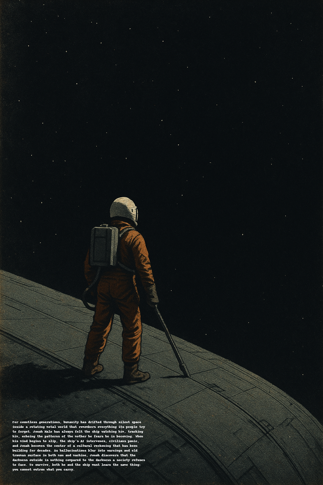

# Endless Darkness

Endless Darkness is a character‑driven science fiction novel set on a vast generation ship that has become both world and cage. As the mission AI quietly turns every life into data, Jonah Hale—a young engineer haunted by family mental illness, faith, and generational trauma—searches for a way to make real home inside the ship’s endless darkness.

This repository contains the working structure of the novel: chapters, worldbuilding documents, character profiles, thematic notes, outlines, and research materials. It is designed for clarity, iteration, and the slow construction of a single, coherent atmosphere of dread.

## Core Premise

Roughly 22,000 years ago, humanity discovered a rogue ice giant on a collision course with Earth. With about 2,000 years to prepare, the world united to build thousands of enormous generation ships and, roughly 20,000 years ago, launched them toward distant stars. The journey itself is a 40,000‑year mission, now halfway complete. Across the millennia since launch, communication with Earth and the other ships has long been lost. No one aboard Jonah’s ship knows whether anything human still waits behind them or ahead of them.

For Jonah, the ship is all he has ever known. Its metal corridors, artificial dawns, and watching systems are his entire sky. It is his world, his cage, and his inheritance. He has always felt the ship watching him, tracking him, echoing the patterns of the mother he fears he is becoming.

Jonah's life begins to shift when he falls in love with Sera Solano, a woman who sees him clearly and does not turn away from what she finds. As Jonah tries to hold his life together, the unresolved storms inside him begin to break open. The ship's AI notices. Civilians panic. Jonah's family notices. Jonah himself cannot avoid the truth—that the instability inside him may be tied to a truth the entire society has been trained to ignore.

Endless Darkness follows Jonah through formation, connection, unraveling, collapse, and restoration as he confronts the reality that the darkness outside is nothing compared to the darkness a society refuses to face. To survive, both he and the ship must learn the same thing: you cannot outrun what you carry.

## Repository Structure

* **chapters**  
  Draft chapters of the novel.

* **docs/characters**  
  Detailed character profiles for Jonah, Sera, Samuel, Lydia, and extended family.

* **docs/worldbuilding**  
  Notes on the ship’s architecture, society, religion, governance, economy, daily life, mission history, AI systems, and core technologies.

* **docs/outline**  
  High‑level arc, act structure, story beats, and thematic breakdowns.

* **docs/scenes**  
  Scene‑level experiments, vignettes, and exploratory narrative fragments.

## Goals

Endless Darkness aims to combine grounded, plausible generation‑ship SF with an intimate emotional core and a quiet, persistent sense of terror. The story uses the scale and isolation of the ship to highlight the inner world of a single life and the people who shape it, and to ask how it feels to try to heal when the environment itself never stops humming with threat.

The novel treats mental illness and faith with seriousness and respect, drawing on real experience and hard emotional truths. It aims to show that healing is possible, love is real, and home can be built even in endless darkness—without pretending that fear disappears, or that the terror of relapse, loss, and cosmic abandonment can be neatly resolved.

## Status

In active development. Chapters and structure will evolve as the manuscript grows.
